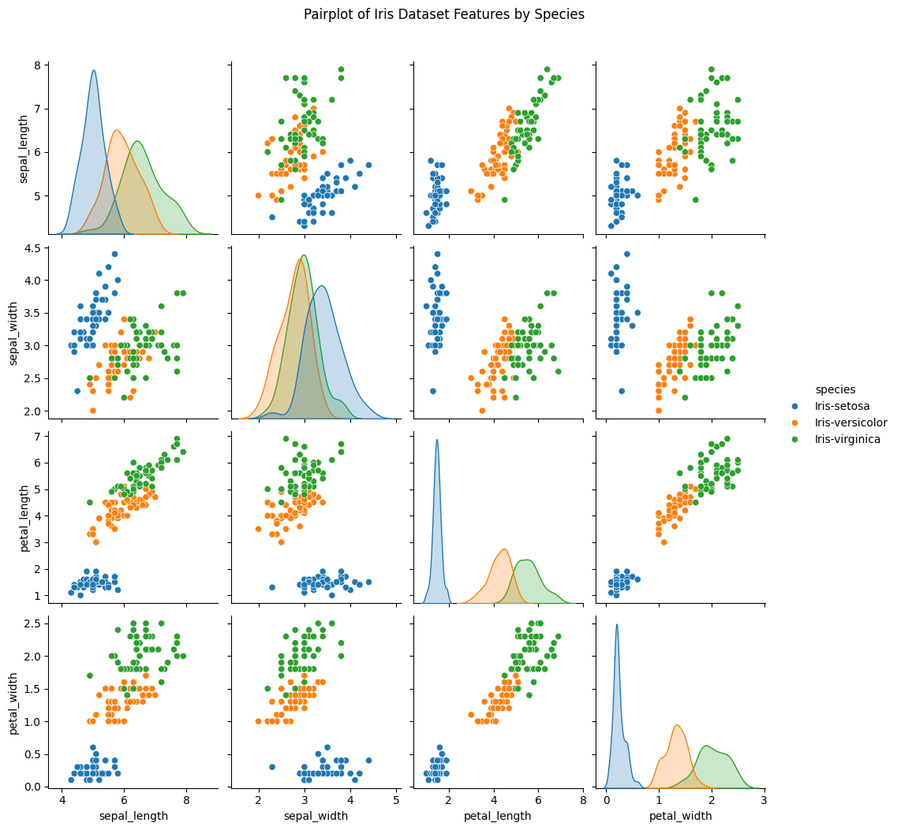

echo # Iris Dataset EDA > README.md
echo An in-depth Exploratory Data Analysis of the Iris dataset using Pandas, Seaborn, and Matplotlib in a Jupyter Notebook. >> README.md
echo. >> README.md
echo ## Overview >> README.md
echo This project explores the Iris dataset, consisting of 150 samples across three species (`Iris-setosa`, `Iris-versicolor`, `Iris-virginica`), with measurements of sepal length, sepal width, petal length, and petal width. The analysis includes: >> README.md
echo - Histograms of feature distributions. >> README.md
echo - A correlation heatmap to identify relationships. >> README.md
echo - A pairplot to visualize feature relationships by species. >> README.md
echo - Box plots and violin plots to compare distributions across species. >> README.md
echo. >> README.md
echo ## Key Insights >> README.md
echo - Petal length and petal width are the most discriminative features, showing clear species separation and a strong correlation of 0.96. >> README.md
echo - Sepal length provides some differentiation, while sepal width exhibits significant overlap across species. >> README.md
echo. >> README.md
echo ## Files >> README.md
echo - `iris_eda.ipynb`: The Jupyter Notebook with the full analysis. >> README.md
echo - `iris_eda.html`: HTML export of the notebook for easy viewing (note: minor accessibility warning about missing alt text on images, to be addressed in future updates). >> README.md
echo - `iris.csv`: The Iris dataset used for the analysis. >> README.md
echo - PNG files (`feature_distributions.png`, `correlation_matrix.png`, `pairplot.png`, `box_plots.png`, `violin_plots.png`): Saved visualizations. >> README.md
echo. >> README.md
echo ## How to View >> README.md
echo Open `iris_eda.html` in a web browser to explore the interactive analysis. >> README.md
echo. >> README.md
echo  >> README.md